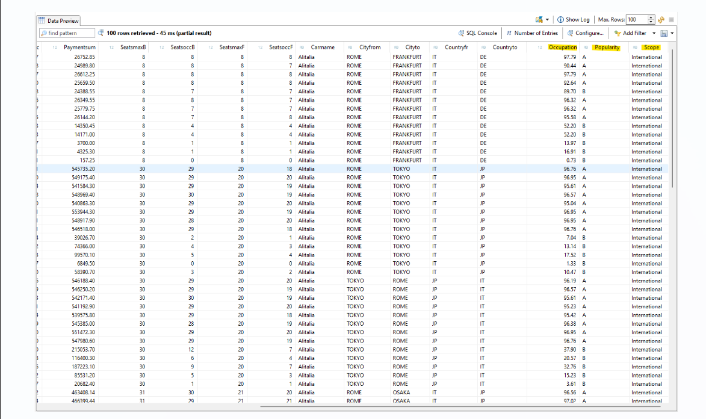
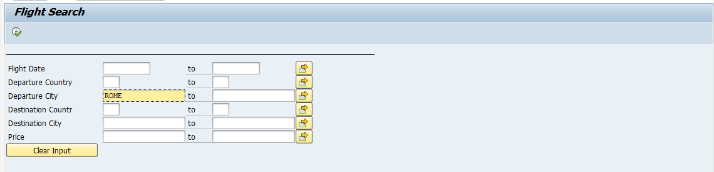
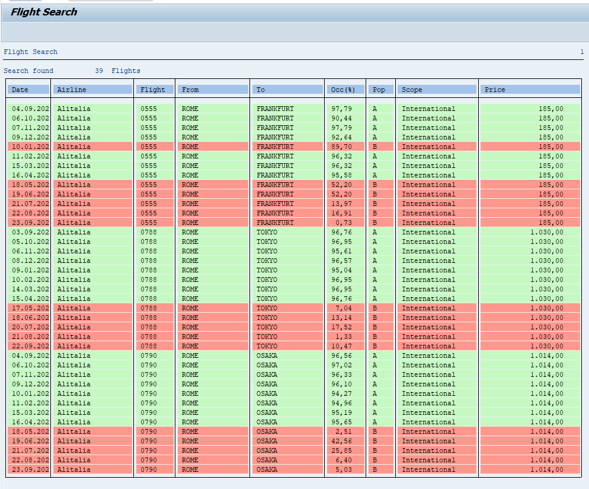

# SAP Flight CDS Analytics
Modern ABAP CDS View Entity implementing flight analytics directly at database level in SAP S/4HANA.

This project demonstrates how business logic can be pushed down to the database using Core Data Services (CDS)  and consumed in a classical ABAP report application.

## Project Overview 

### Data Layer – CDS View Entity 
- Built on SFLIGHT 
- Uses associations to SCARR and SPFLI 
- Calculates: 
  - Occupation (%) 
  - Popularity (A/B) 
  - Scope (Domestic / International) 
- Filters flights to EUR only 

 

### Application Layer – Search Report 

- Classical ABAP report with selection screen 
- Filters using SELECT-OPTIONS 
- Retrieves data via ABAP SQL from CDS view 
- Displays: 
  - Flight details 
  - Calculated KPIs 
  - Color highlighting (A = green, B = red) 
- Handles incomplete input 
- Includes clear input button 

 

 